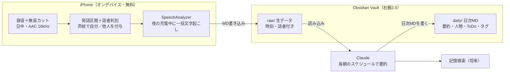

# kikitxt 概要仕様書（音声ライフログ文字起こしアプリ）

## 1. 目的・スコープ・前提

文字起こしはiPhone内で完結（無料・オフライン）させ、有料APIはClaudeによる1日1回の要約だけに絞る。これでランニングコストを最小化する。

- 目的：自分の発話と日常会話を常時文字起こしし、日次MDとしてObsidian（右腕2.0）に蓄積。将来「過去の記憶」を検索できるようにする
- 利用者：本人1名（個人利用、App Store公開は当面しない）
- 対象OS：iOS 26以降（オンデバイス文字起こしAPI「SpeechAnalyzer」が使えるバージョン）
- スコープ外（v1）：他人の名前の自動識別、リアルタイム翻訳、他人への共有
- 前提：文字起こしは Speech フレームワークの SpeechAnalyzer / SpeechTranscriber。任意で、同じくオンデバイスの Foundation Models（Apple製LLM）を前処理に使う

## 2. 全体アーキテクチャ



音声はiPhoneの外に出さず、Vaultには文字だけを渡す。Claudeは生データを読んで日次MDを書き、将来は同じVaultを検索して記憶を探す。

## 3. 文字起こしエンジンと省電力設計

日中は録音だけ、文字起こしは充電中にまとめて行う。SpeechAnalyzerは日本語（ja-JP）対応で、リアルタイムより録音後の一括処理のほうが精度が高いという検証報告があり、精度と電力の両面で有利。

### エンジン

- SpeechAnalyzer + SpeechTranscriber（iOS 26〜、完全オンデバイス、API料金ゼロ、旧APIの1分制限なし）
- 言語モデルは AssetInventory で初回ダウンロード。起動時に有無を確認し、無ければWi‑Fi時に取得
- 対応機種が限られる（古い機種ではiOS 26でも不可の報告あり）→ 実機で `SpeechTranscriber.isAvailable` を最初に検証

### 省電力の工夫

1. 二段階処理：日中は圧縮録音（AAC・モノラル・16kHz）のみ。文字起こしは BGProcessingTask（外部電源接続を条件）で夜の充電中に実行
2. 無音カット（VAD）：無音区間を捨て、発話区間だけを数分単位のファイルに分割保存
3. 常時録音の仕組み：Background Modes の audio を有効にし録音を継続。電話等の割り込み後は自動再開
4. 録音モード切替：「常時」「会議中だけ」「手動」をウィジェット／アクションボタンから切替
5. 音声ファイルは文字起こし後に削除（保持日数を設定可）

電力の実測値は公開情報がないため、試作段階で「常時録音のみで8時間」の電池減少を測る。

### 話者判別（自分／他人）

声紋方式を採用。SpeechAnalyzerには話者判別機能がないため、FluidAudio（Swift、Apache 2.0、Neural Engineで動作）を組み合わせる。

1. 声紋登録：初回設定で自分の声を数十秒録音し、声の特徴を端末内に保存
2. 発話ごとに照合：発話区間の声の特徴を登録済みの声と比べ、「自分」か「他人A・B…」を付与
3. 無音カットも兼用：FluidAudioのVADで発話区間だけを文字起こしと話者判別に回す
4. 名前の推定：他人の名前は日次要約時にClaudeが文脈から推定

騒がしい場所や同時発話では誤判定が出る。AirPodsなど口元に近いマイクで精度が上がる。

### 検討中：リアルタイム方式

SpeechAnalyzerはマイク入力を直接流して即時文字起こしでき、音声をほぼ貯めない構成も可能。ただし精度低下の報告あり・日中の電力増。バックグラウンドで継続動作するかはPoCで検証。

## 4. Claude連携・日次MD生成とコスト

推奨は案A。アプリは生データをVaultに置くだけにし、要約は既存のClaudeサブスクのスケジュールタスクで行う。API課金なし、右腕2.0のルール（CLAUDE.md）もそのまま効く。

| 案 | 仕組み | 追加コスト | 向き不向き |
|---|---|---|---|
| A（推奨） | アプリ→Vaultに生データ保存。毎朝、Cowork/Claude Code のスケジュールタスクが日次MDを生成 | なし（サブスク内） | 実装が最小。Macが起動している前提 |
| B | アプリが充電中に Claude API（Message Batches）へ送信し、結果をVaultへ書く | Haiku 4.5で月約$1、Sonnet 5.5で月約$2（試算） | iPhone単体で完結。APIキー管理が必要 |
| C | iOS 27の Foundation Models 経由で Anthropic公式Swiftパッケージを呼ぶ | Bと同等 | OAuth認証でキー管理が楽 |

試算前提：1日入力5万トークン、出力5千トークン、Batch API（50%引）、月30日。

### 日次MDでClaudeにやらせること

- フィラー除去・誤認識の文脈補正
- 時間帯ごとの出来事要約、人物・場所・案件名の抽出（[[リンク]] 化）
- ToDo・決定事項の抽出、検索用タグ付け

## 5. Obsidian保存形式と将来の記憶検索

生データと要約を分けて保存し、要約で拾い漏れた記憶も生データから探せるようにする。

### 保存先（案）

- 生データ：`kikitxt/raw/2026-09-30.md`（発話区間ごとに時刻と話者を付けて追記。例：`09:12 [自分] …`、`09:13 [他人A] …`）
- 日次要約：`kikitxt/daily/2026-09-30 水_kikitxt.md`
- VaultがiCloud Drive上にあれば、アプリからフォルダを一度選択させ、そのアクセス権を保存して直接書き込む

### 日次MDの型

```markdown
---
date: 2026-09-30
type: kikitxt
people: [山田, 佐藤]
places: [学内]
tags: [kikitxt, 会議]
---
## サマリー（3行）
## 時間帯別の出来事
### 09:10–09:40 ○○の打合せ
## 決定事項・ToDo
## 気づき・メモ
```

### 記憶検索の段階的実現

1. v1：Claudeに「去年秋に○○さんと話したのは何だった？」と聞き、Vaultを検索して回答（追加開発なし）
2. v2：日次MDを月次・年次に要約したMOCを自動生成
3. v3：意味検索。iOS 27のSpotlight連携ローカルRAG、または端末内の埋め込みベクトルでiPhone単体検索

## 6. 技術スタック・開発言語

言語は Swift（UIはSwiftUI）一択。必要なApple機能はすべてSwiftネイティブで、クロスプラットフォームの利点はない。

| 層 | 採用技術 | 役割 |
|---|---|---|
| UI | SwiftUI、WidgetKit、App Intents | 録音開始／停止、モード切替、ロック画面・アクションボタン操作 |
| 録音 | AVFoundation（AVAudioEngine、AVAudioSession） | 常時録音、割り込み復帰 |
| 話者判別・VAD | FluidAudio（SPMで導入） | 声紋による自分／他人判別、無音カット |
| 文字起こし | Speech（SpeechAnalyzer、SpeechTranscriber、AssetInventory） | 日本語のオンデバイス文字起こし |
| 実行制御 | BackgroundTasks（BGProcessingTask） | 充電中の一括処理 |
| データ | SwiftData | 録音区間・処理状態の管理 |
| 前処理（任意） | Foundation Models | フィラー除去・区間要約 |
| 出力 | FileManager（セキュリティスコープ付きブックマーク） | Obsidian Vault（iCloud Drive）へのMD書き込み |
| 要約 | 案A：Coworkスケジュールタスク／案B・C：Claude API | 日次MD生成 |

開発環境：MacのXcode、実機はApple Intelligence対応iPhone。Apple Developer Program（年額有料）登録で実機に長期インストール。コードはClaude Codeで書かせる前提で実現可能な規模。

## 7. リスク・注意点と開発ステップ

会話相手の同意を得ることを前提とする。そのうえで残るリスクは以下。

### リスク

- 同意・規程：録音中表示（Live Activity等）で相手に分かるようにする。同意が取れない場面用に即時停止・直近区間の削除ボタンを用意
- 外部送信：他人の発言を含むテキストがClaudeに渡るため、機微ワード除外などのルールを決める
- 対応機種：古いiPhoneではSpeechTranscriberが使えない報告あり
- バックグラウンド停止：電話・他アプリの音声・再起動で録音が止まるケース。停止検知と通知で対応
- 話者の区別：声紋で判別できるのは「自分／他人」まで。騒音下や同時発話では誤判定があるため、PoCで精度を実測

### 開発ステップ

1. PoC（1、2週）：実機で録音→日本語文字起こし＋声紋判別。精度・処理時間・電池減少を実測
2. MVP：常時録音＋無音カット＋話者判別＋充電中一括文字起こし＋Vaultへの生データ書き込み
3. 要約連携：案Aのスケジュールタスクと日次MDテンプレート（右腕2.0のスキル化）
4. 検索：月次MOC → 意味検索（v3）

### 要判断（未決）

- 要約は案A（サブスク・Mac依存）と案B（API・iPhone完結）のどちらで始めるか
- 一括処理方式とリアルタイム方式のどちらを基本にするか
- 業務時間中の録音を対象に含めるか
- Vaultの保存場所（iCloud Driveか否か）

## 出典

- Sansan Tech Blog：SpeechAnalyzerとSFSpeechRecognizerの比較と落とし穴
- Qiita：SpeechAnalyzerの日本語ストリーミング認識検証
- WWDC26：What's new in the Foundation Models framework
- Claude API 料金
- FluidAudio（GitHub）
